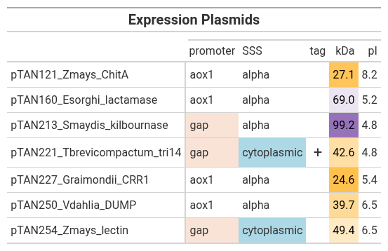

# komagataella

## Description

This package is for analyzing DNA sequence files from pPICZ and pGAPZ expression plasmids.
These plasmids are commonly used to express recombinant proteins in the yeast
*Komagataella phaffii* (*Pichia pastoris*). The program extracts the coding
sequence for the recombinant protein and produces a protein summary.

There are two major use cases:
1. Choosing a particular plasmid/protein from the database for detailed analysis.
2. Producing a nicely formated table that summarizes the entire database.


## Installation
Steps to install and run your project.

## Usage
Example files are included in `data/`. Each file is placed inside of a unique folder; for example: `data/pTAN121/pTAN121.fa`. New files can be added similarly. The DNA sequence fasta files must end in either `*.fa` or `*.fasta`.

To run the program, type `python3 main.py`. This will launch an interactive menu.


If a single plasmid/protein is selected, text output is produced:

```name: pTAN160_Esorghi_lactamase
promoter: aox1
secretion: alpha
coding sequence: ATGAGATTTCCTTCAATTTT...ATCATCATCATCATCATTGA (2203bp)


>pTAN160_Esorghi_lactamase
EFFPANQQDLTFAKRNGTFEQSVFYGLTGPEVEAKLAKLKADGYRPTSLNIHGSTSDAKY
AGIWTKQTGDDFETILGANKTVYDAWLDSHKAQGYVSTHVSATGGSSDALFAGVMEKVPS
VANWIQVCGLDNPYAYANATIDEPMYIKGVSMYGAPNERQYCILGHENLVNYQQTVFYQT
DYFKKDYAKLLQSETSKRHWRPVFIDLSEDLLPTPIFDDTSVGQWVARTDLSASELEAEI
AAQKAKNLYAVHIAGAGSKGSKYAVLFAEHLSPLERKWTVTGEVTGFKTNDVVAKDMDAV
MEEFMKKNSVRQAQVAASVNGTVVAERSYTWAESDRAVVKPTDKFGLGSVSKMFTYAATT
NLLNEGLLNHTTRVYPFLGMNNPADNRSLDITVDHLLQHTAGYNRDIKPDIGFIFRNIAL
ERNQTTPVSLRELIEYVYEQPLDFTPGTDSVYSNYGTMLLSYLIANITGESFNSYIHKNV
LNGLDVELYPTSPELNANNPIVQETKYTFYPAQDPASTKQVSNANGGDGSIREEAIGAFG
LRASASTISQFLANHAAYDIGPRQAYTYRDGTIVGSRAFAQSQDLIDWSLILNTREYESE
QKWEQLVFGPISQWYKYALAE

Mass: 69.00 kDa
Length: 621 amino acids
Not tagged
pI: 5.18

Press Enter to continue...
```

If the entire database is selected, a table is produced:



